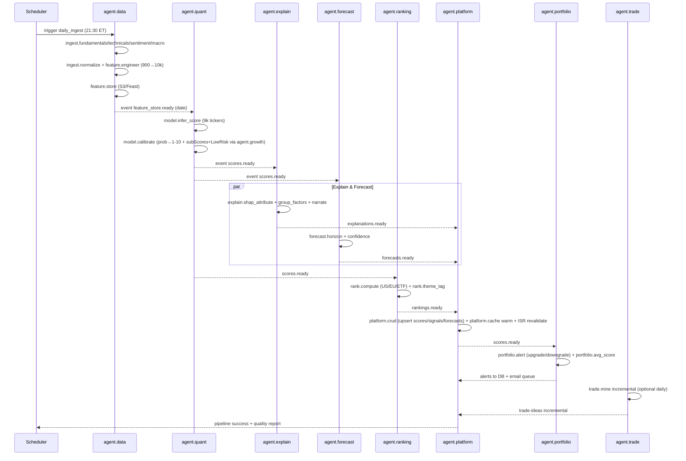

# WF1 — Daily Scoring Pipeline (End-to-End)

**ID:** `WF1`  
**Name:** Daily Stock Scoring — 10k Features → Invelix Score 1-10 → Rankings  
**Trigger:** Cron `30 21 * * 1-5` ET (21:30 ET, Mon-Fri, after US close)  
**Frequency:** Daily (trading days)  
**Duration SLA:** ≤120 min end-to-end  
**Participants:** `agent.data` → `agent.quant` → `agent.explain` → `agent.forecast` → `agent.ranking` → `agent.platform` → `agent.portfolio` → `agent.trade` (+ `agent.growth` for Low Risk)  
**Output:** Fresh scores for 9k+ tickers on `/us-stocks`, `/european-stocks`, `/top-etfs`, and all `/stock/:ticker` pages by 23:30 ET.

---

## Goal

Reproduce Danelfin’s daily update: “AI Score updated daily, analyzing +10,000 features per stock per day.” By morning, every investor sees today’s rankings, scores, and alerts.

## Sequence Diagram (Mermaid)



## Steps (Detailed)

### 1. Ingestion (21:30-22:00, `agent.data`)
- Fetch 600 technical (including chart patterns 60/120/180/504d), 150 fundamental, 150 sentiment per ticker.
- Normalize (split/dividend adjust, PIT, survivorship-free), validate (<0.5% missing).
- Engineer 10k features via `feature.engineer` (z-scores, lags, interactions, cross-sectional ranks).
- Write `s3://invelix-feast/date=2026-09-12/` + emit `feature_store.ready`.

**Guard:** If vendor timeout, retry 3x fallback; if still fail, mark ticker stale and reuse yesterday.

### 2. Scoring (22:00-22:15, `agent.quant` + `agent.growth`)
- Load ensemble vX from MLflow, infer for all tickers batch-parallel.
- Example: AAPL → 56.00% prob → advantage +5.27% → Score 6; sub-scores F:8 T:5 S:5 LR:6 (Low Risk from `agent.growth` risk model).
- Calibrate via Platt; bucket to 1-10 by decile of advantage vs universe mean 50.73%.
- Emit `scores.ready` + persist to `scores` table.

### 3. Explain & Forecast (22:15-22:45, parallel)
- `agent.explain`: TreeSHAP per ticker → rank signals → group factors → narrate. Sum checks to advantage ±0.01%. For free tier, mark signals 11-28 as `locked`.
- `agent.forecast`: for liquid tickers, predict 1M/3M/6M/1Y avg/high/low + 68% interval. Example AAPL 3M avg $332.17 high $372.53 low $272.88.

### 4. Ranking (22:45-23:00, `agent.ranking`)
- Sort universes: US ranked by score desc (ITUB 10 rank1, EQX 10 rank2…), EU STOXX, ETFs.
- Compute change vs yesterday, Perf YTD, country flag.
- Warm Redis `ranking:*` + materialized view; emit `rankings.ready`.

### 5. Platform Publish (23:00-23:15, `agent.platform`)
- Upsert scores/signals/forecasts idempotently; warm caches; trigger Vercel ISR revalidation for `/us-stocks`, `/top-etfs`, etc.
- Stale-while-revalidate: if pipeline delayed, serve yesterday with “as of 2026-09-11” banner.

### 6. Downstream Fans (23:15-23:30, `agent.portfolio` + `agent.trade` incremental)
- `agent.portfolio`: for each portfolio, recompute Avg Score, Diversity, detect upgrades/downgrades → push alerts (email/push/in-app).
- `agent.trade`: incremental win-rate update (full mine weekly).

## Data Flow

```
Raw APIs → Clean PIT → 10k features (Feast) → Scores (prob→1-10) → Explanations (signals) + Forecasts (cones) → Rankings (sorted) → Cache/DB → Alerts
```

## Error Handling

| Failure | Detection | Mitigation |
|---------|-----------|------------|
| Vendor outage | missing >5% tickers | fallback vendor + stale flag |
| Model load fail | exception | fallback to previous MLflow version |
| SHAP OOM | timeout | per-ticker chunking, retry slow lane |
| DB write fail | retry 3x | idempotent upsert, dead-letter queue |
| Pipeline >SLA | SLA monitor | alert Ops, serve stale + status page |

## Success Metrics (SLOs)

- End-to-end p95 <120 min, success >99.5% trading days
- Coverage = scored / ingested >99.5%
- Calibration monotonic: avg alpha by score bucket increases with score
- Cache warm success 100%
- Alert delivery <60 min after `rankings.ready`

## Artefacts

- Feature Store partition, `scores` rows 9k, `alpha_signals` ~250k rows (28×9k), `forecasts` ~36k rows (4 horizons ×9k), `rankings_mv` refresh, quality report JSON.
