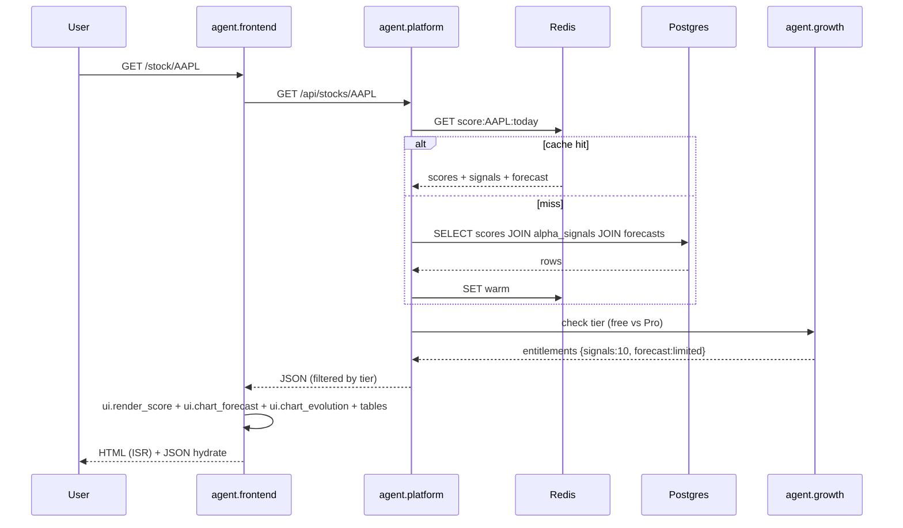

# WF2 — Stock Detail Page Generation (On-Demand)

**ID:** `WF2`  
**Name:** On-Demand Stock Deep Dive — `/stock/:ticker`  
**Trigger:** User navigates to `/stock/AAPL` (or API `GET /api/stocks/:ticker`)  
**Frequency:** On-demand, ~150k views/day  
**Latency SLA:** <400ms cached, <900ms miss  
**Participants:** `agent.frontend` → `agent.platform` → `agent.ranking` (metadata) + `agent.data` (raw values) + `agent.quant` (scores) + `agent.explain` (signals) + `agent.forecast` (cone) + `agent.trade` (win-rate) + `agent.growth` (paywall)

---

## Goal

Render Danelfin-identical stock detail page with 7 sections — as seen on `danelfin.com/stock/AAPL` — from cached scores, with paywall for free tier. No recompute on read; just assemble.

## Page Sections (Danelfin Parity)

1. **Header** — price $326.61, 1M/3M/6M/1Y/5Y/All chart + Advanced Chart link, custom range.
2. **AI Score Explanation** — pill Score 6 Hold, sub-scores 8/5/5/6, paragraph narrative (+1.83% long tail etc.), notable data points (PP&E top 10% $51,431M, P/B 44.16 top 10% detractor).
3. **Alpha Factors** — 7 bars with net impact: Valuation +2.60%, Momentum +1.30%, Sentiment +0.83%, Size +0.29%, Financial Strength +0.20%, Growth +0.15%, Earnings Quality +0.05%, Volatility -0.15% → total +5.27%.
4. **Alpha Signals Table** — top 28 signals with Type, Signal, Value, Decile, Impact ±%; rows 1-10 visible, 11-28 “Upgrade to unlock” blurred +0.33% etc.; “View more” + “Rest +0.03%” + total +5.27% + “Significant changes vs previous day”.
5. **Trading Parameters** — Entry $326.61, Horizon 3M, Stop Loss / Take Profit blurred for Pro + fallback “or AI Score <4/10”.
6. **Forecast Cone** — toggle Invelix AI vs Analysts; horizons 1M/3M/6M/1Y; confidence 68%; values AAPL 3M avg $332.17 +1.70% high $372.53 low $272.88 vs analysts $339.15 +3.84%; “Unlock AI-powered forecast” paywall + “Why numbers differ” note.
7. **Win Rate Table** — 1260 past Hold signals → Avg Perf/Avg Alpha/Win Rate/% Positive Alpha at 1M/3M/6M/1Y (1Y +30.35% +17.89% 86.59% 70.80%).
8. **Scores Evolution** — line chart 1-10 daily/weekly/monthly/quarterly with timeframe toggles.
9. **FAQs + News + Similar Stocks**

## Sequence Diagram

## Steps

### 1. Frontend Request (Edge)
- Next.js ISR: `getStaticProps` with `revalidate 3600`; if cache miss and not yet generated, SSR fallback.
- Call `platform.search` for header autocomplete (preloaded).

### 2. Platform Assemble
- Fetch from Redis; on miss query Postgres (single join).
- Join with `agent.ranking` metadata (company name, country flag, sector).
- Apply tier filter: free sees 10 signals + blurred forecast high/low; Pro sees all 28 + full numbers.
- Return JSON with `invelixScore`, `probability`, `advantage`, `subScores`, `alphaFactors`, `alphaSignals`, `tradingParams`, `forecast`, `winRate`, `evolution`.

### 3. Frontend Render
- `ui.render_score`: pill + gradient bar + sub-scores grid.
- `ui.chart_forecast`: cone with horizon toggle (default 3M) + analyst toggle + confidence badge.
- Signals table with decile dots (●) and impact green/red bars.
- Trading Parameters card (blurred values for non-Pro).
- Evolution chart default Daily with 1-10 y-axis.
- SEO: `<title>Apple Inc (AAPL) AI Stock Analysis | Invelix</title>`, JSON-LD `FinancialProduct`.

### 4. Telemetry
- Emit `pageview stock_detail` to PostHog with ticker, score, tier.

## Caching

- Redis `score:{ticker}:{date}` TTL 1h + SWR 24h
- CDN ISR TTL 3600; revalidated via webhook on `scores.ready`
- WinRate table cached weekly (expensive backtest)

## Error Handling

| Case | Response |
|------|----------|
| Unknown ticker | 404 + search suggestions |
| Stale score (today missing) | serve yesterday + “as of” banner |
| Forecast insufficient history | hide cone, show “Insufficient data” |
| Free tier limit exceeded (11th detail view) | paywall modal + “Upgrade to unlock” |

## Success Metrics

- p95 latency <400ms cached, <900ms miss
- Cache hit >92%
- Paywall conversion on detail >8% of free users
- No layout shift (CLS <0.05)
