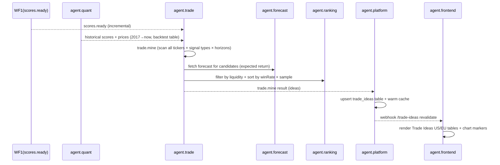

# WF3 — Trade Ideas Discovery

**ID:** `WF3`  
**Name:** “Stocks With the Best Track Record” — Trade Ideas Engine  
**Trigger:** Cron `0 2 * * 1` (weekly full) + incremental daily after `scores.ready` (incremental)  
**Frequency:** Weekly full mine + daily incremental  
**Participants:** `agent.quant` (backtest) → `agent.trade` (mine) → `agent.forecast` (filter) → `agent.ranking` (sort) → `agent.platform` (cache) → `agent.frontend` (pages `/trade-ideas`, `/european-trade-ideas`, chart overlays)

---

## Goal

Reproduce Danelfin’s Trade Ideas: discover tickers where Buy/Strong Buy (Score 7-10) had ≥60% win rate (positive 3M return) or Sell/Strong Sell (Score 1-4) had ≥60% loss rate since 2017, with forecast overlay. Provide ranked list + per-stock track record on chart.

## Definitions (Danelfin Parity)

- **Buy:** Score 7-8
- **Strong Buy:** Score 9-10
- **Sell:** Score 3-4
- **Strong Sell:** Score 1-2
- **Hold:** Score 5-6 (excluded from Trade Ideas, but win-rate shown on detail)
- **Win Rate:** % of signals where forward return >0 at horizon (1M/3M/6M/1Y)
- **Loss Rate:** % where forward return <0 for Sell ideas (interpreted as “would have lost if you bought”)
- **Threshold:** ≥60% and ≥50 signals since 2017

## Sequence Diagram



## Steps

### 1. Pull History (agent.quant)
- Backtest table: every signal (date, ticker, score→signal type) + forward returns at 1M/3M/6M/1Y.
- Example AAPL: 1260 Hold signals; for Trade Ideas we care about Buy/Sell signals.

### 2. Mine (agent.trade `trade.mine`)
- For each ticker, for each signal type (Buy, Strong Buy, Sell, Strong Sell), for horizon 3M (primary) and also 1M/6M:
  - Compute `winRate = count(positive)/count(total)` for Buy ideas; `lossRate = count(negative)/count(total)` for Sell ideas.
  - Compute `avgPerf`, `avgAlpha` (vs S&P/STOXX).
  - Filter: `winRate >=0.60` and `count >=50` for Buy; `lossRate >=0.60` for Sell.
  - Rank by `winRate * log(count) * recencyBoost` (recent 1Y weight 1.5×).

**Example qualifiers:**
- ITUB Strong Buy 420 signals → 68% win, avg +18% → qualify Buy idea
- EQX Strong Buy 380 signals → 66% win → qualify
- A downtrend ticker Sell 300 signals → 64% loss → qualify Short idea

### 3. Forecast Overlay (agent.forecast)
- For each qualifier, attach forecast 1M/3M/6M avg/high/low. Filter out if forecast conflicts strongly with historical direction (optional).

### 4. Ranking & Liquidity Filter (agent.ranking)
- Exclude illiquid (<$1M ADV) or microcap (<$300M).
- Apply country universe split: US vs EU.

### 5. Publish (agent.platform)
- Upsert `trade_ideas` table: `ticker, signal_type, horizon, winRate, avgPerf, count, forecast`.
- Cache `trade_ideas:US` and `trade_ideas:EU` + paginated API.
- Webhook to revalidate `/trade-ideas` and `/european-trade-ideas`.

### 6. Frontend (agent.frontend)
- **Trade Ideas US page:** table `Ticker | Company | Signal | Win Rate | Avg Perf (3M) | Forecast (3M) | Chart` sorted by winRate desc.
- **Detail chart:** price line + green ▲ Buy / red ▼ Sell markers since 2017 + dotted forecast cone for next 3M.
- **Stock detail win-rate table:** on `/stock/:ticker` show per-signal win-rate (e.g., Hold 1260 → 86.59% win at 1Y).

## Data Example

```json
{
  "ticker": "ITUB",
  "signal": "Strong Buy",
  "horizon": "3M",
  "winRate": 0.68,
  "avgPerf": 0.18,
  "count": 420,
  "forecast": {"avg": 45.2, "high": 52.1, "low": 38.3, "horizon": "3M"}
}
```

## Error Handling

- Low sample (<50) → never surface, even if 100% win (avoids luck).
- Backtest compute heavy → chunk by universe, cache weekly; incremental daily only for tickers with new signal.
- Missing forecast → show idea without cone.

## Success Metrics

- Ideas surfaced: 200-400 US + 80-150 EU typical
- No idea below threshold (audit 100%)
- Chart marker render <300ms
- Click-through Trade Ideas → Stock Detail >40%

## Artefacts

- `trade_ideas` table, chart overlay JSON, revalidated pages.
