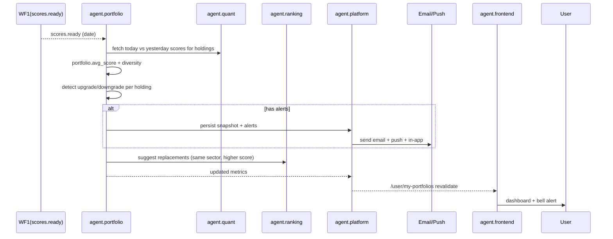

# WF4 — Portfolio Monitoring & Alerts

**ID:** `WF4`  
**Name:** Portfolio Coach — Average Score, Diversity & Daily Alerts  
**Trigger:** `scores.ready` at 22:15 ET (event) + user CRUD `POST /api/portfolios` (real-time) + cron `0 22 * * 1-5` (22:00 fallback)  
**Frequency:** Daily per-portfolio check + per-edit  
**Latency SLA:** Alerts sent ≤60 min after scores  
**Participants:** `agent.portfolio` → `agent.quant` (scores) → `agent.ranking` (replacements) → `agent.platform` (persist + notify) → `agent.frontend` (dashboard) → `agent.growth` (tier check)

---

## Goal

Reproduce Danelfin homepage promise: “Monitor the daily AI Score changes… Receive alerts when a stock in your portfolio is downgraded or upgraded… Average AI Score, Portfolio Diversity Score, and daily alerts.” Turn passive holdings into active coaching.

## Portfolio Metrics (Danelfin Parity)

- **Average Invelix Score:** weighted by position size (equal weight if not supplied) — 1-10.
- **Diversity Score:** 1-10, composite of sector concentration (Herfindahl), geo concentration, market-cap spread. 10 = well diversified.
- **Evolution:** sparkline per holding + portfolio-level score over time.
- **Alerts:** upgrade (e.g., 6→8), downgrade (7→5), threshold cross (<4 Sell zone).

## Sequence Diagram



## Steps

### 1. Fetch Context (`agent.portfolio` triggered)
- Load all portfolios (150k users × avg 1.8 portfolios).
- For each holding, fetch today score & yesterday score from `agent.quant` via `agent.platform` cache.

### 2. Compute Metrics
- **Avg Score:** `Σ(score_i × weight_i) / Σ(weight_i)`.
- **Diversity:** 
  - Sector Herfindahl = Σ(sector_weight²); Diversity = 10 − 9×normalized Herfindahl.
  - Geo + market-cap penalties similar.
  - Example: AAPL (tech) + ITUB (finance BR) + VALE (materials BR) + TSLA (auto) → sector spread good but geo BR 50% → Diversity 6/10.

### 3. Detect Alerts
- **Upgrade:** `score_today - score_yesterday >= 2` (or cross 7 threshold).
- **Downgrade:** `≤ -1` or fall below 4.
- Example: TSLA 4→5 (no alert, minor), AAPL 7→5 (alert: downgraded Hold, -2). Message: “⚠️ AAPL downgraded 7→5 (Hold). Probability -4.2pp.”

### 4. Persist & Notify (`agent.platform`)
- Write `portfolio_snapshots` (date, avg, diversity, holdings json).
- Write `alerts` table, enqueue SendGrid + FCM jobs via BullMQ.
- Tier check via `agent.growth`: free gets weekly digest, paid gets instant.

### 5. Rebalance Suggestion
- For lowest-scored holding (e.g., TSLA 5), query `agent.ranking` for top 5 same-sector candidates with Score 9-10 → suggest NVDA 9.

### 6. Frontend (`agent.frontend`)
- **Dashboard `/user/my-portfolios`:**
  - Portfolio cards: name, holdings table (ticker flag score change sparkline), Avg Score pill, Diversity pill, alerts bell (count).
  - Holdings table: green ▲ / red ▼ change, Perf YTD.
  - CTA: “Create your first portfolio” empty state with search.

## Example Alert Payload

```json
{
  "user": "u_123",
  "portfolio": "Tech Growth",
  "alerts": [
    {"ticker": "AAPL", "from": 7, "to": 6, "type": "downgrade", "message": "AAPL downgraded 7→6. Probability -1.2pp."},
    {"ticker": "TSLA", "from": 4, "to": 5, "type": "upgrade", "message": "TSLA upgraded 4→5."}
  ],
  "metrics": {"avgScore": 7.75, "diversity": 6, "suggestion": "Replace TSLA (5) with NVDA (9) tech sector → avg 8.25"}
}
```

## Error Handling

- Holding not scored today → use yesterday + “stale” badge, no alert.
- Email bounce → retry 3x, still keep in-app.
- Large user base → batch 1k portfolios per job, rate-limit email to avoid spam flag.

## Success Metrics

- Alerts sent ≤60 min after scores, 99% delivery
- Dashboard load <600ms
- Alert open rate >35%, CTR to detail >25%
- Avg Score improvement after suggestion >+0.6 within 30 days (retained users)

## Artefacts

- `portfolio_snapshots` rows daily, `alerts` rows, email queue, revalidated dashboard.
