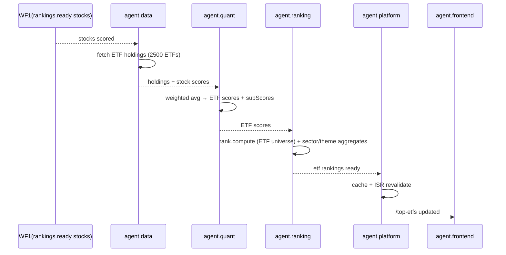

# WF5 — ETF & Thematic Ranking

**ID:** `WF5`  
**Name:** ETF & Sector/Theme Leaderboards  
**Trigger:** After `rankings.ready` for stocks (23:00 ET) — chained, or cron `0 23 * * 1-5`  
**Frequency:** Daily  
**Participants:** `agent.data` (ETF holdings) → `agent.quant` (ETF scoring via holdings-weighted) → `agent.ranking` (compute) → `agent.platform` (cache) → `agent.frontend` (`/top-etfs`, sector/theme pages)

---

## Goal

Reproduce Danelfin’s ETF & Thematic coverage: “Analyze US-listed stocks, STOXX Europe 600, and US-listed ETFs” and theme pages. Provide ranked ETFs by Invelix Score (derived from holdings), plus sector/industry/theme aggregates.

## ETF Scoring Method (Holdings-Based)

ETFs have no fundamentals themselves → score = weighted average of holdings’ Invelix Scores (same as Portfolio Avg). For leveraged/inverse ETFs, flag and score via underlying exposure.

- **Universe:** ~2,500 US-listed ETFs (SPY, QQQ, VTI, ARKK…).
- **Holdings:** from `agent.data` (ETF constituents via FMP / holdings API), cached daily.
- **Score:** `ETF_Score = round_weighted_avg(holdings scores)` → 1-10 pill.
- **Sub-scores:** similarly weighted.
- Example: SPY (holds AAPL 6, MSFT 7, NVDA 9…) → ETF Score 7.

## Sequence Diagram

## Steps

### 1. Fetch Holdings (`agent.data`)
- Daily ETF holdings snapshot (e.g., SPY 503 holdings, QQQ 100).
- Normalize weights, handle missing holdings → fallback to last snapshot.

### 2. Compute ETF Scores (`agent.quant`)
- For each ETF: `score = Σ(holding_score × weight)` rounded.
- Sub-scores similarly.
- Compute Perf YTD for ETF price.

### 3. Ranking (`agent.ranking`)
- Sort ETFs by score desc, then Perf YTD.
- Also compute per-sector/per-theme aggregates: average stock score in sector (e.g., Technology avg 6.4, Energy avg 5.8).
- Provide filters: country, sector, provider (Vanguard, iShares).

### 4. Platform & Frontend
- Cache `etf_ranking:{sector}:page`.
- Frontend `/top-etfs` table columns: Rank | ETF (ticker+name) | Provider | AI Score | Change | Fundamental/Technical/Sentiment/Low Risk (weighted) | Perf YTD | Holdings count.
- Theme pages: e.g., `/themes/ai` → top AI stocks by score.

## Example ETF Row

| Rank | ETF | Provider | AI Score | Chg | F | T | S | LR | Perf YTD |
|------|-----|----------|----------|-----|---|---|---|----|----------|
| 1 | SMH | VanEck | 9 | +1 | 8 | 9 | 7 | 6 | +22% |
| 2 | XLF | SPDR | 8 | 0 | 7 | 8 | 6 | 7 | +9% |

## Error Handling

- Holdings missing → use previous day + stale badge.
- ETF with <30% holdings scored → mark “insufficient data”.
- New ETF → infer after 30 days history.

## Success Metrics

- Coverage: 100% of ETF universe with score or flag
- Latency: ETF rankings ready ≤30 min after stock rankings
- Frontend LCP <2s for /top-etfs
