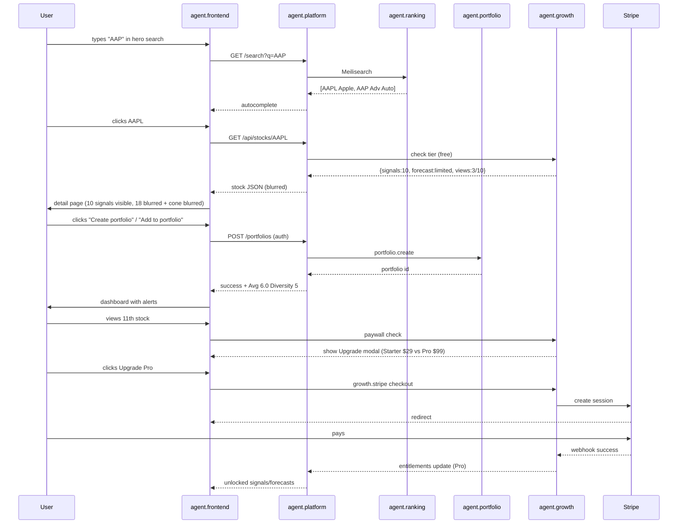

# WF6 — Acquisition & Conversion (Search → Portfolio → Paywall)

**ID:** `WF6`  
**Name:** User Journey — From Search to Paid Conversion  
**Trigger:** User events: `homepage_search`, `ranking_click`, `stock_detail_view`, `portfolio_create`, `paywall_view`, `checkout_start`  
**Frequency:** Real-time, event-driven (150k users)  
**Participants:** `agent.frontend` (UI) → `agent.platform` (search, auth) → `agent.ranking` (results) → `agent.portfolio` (onboarding) → `agent.growth` (pricing, Stripe)  
**Goal Funnel:** `Search → Ranking → Stock Detail → Portfolio → Upgrade → Paid`

---

## Goal

Optimize the Danelfin-style growth loop: user searches “Apple”, sees ranking, opens AAPL detail (Score 6 Hold with blurred forecast), creates portfolio, hits 10-stock free limit, converts to Starter/Pro. This workflow orchestrates frontend + platform + growth to maximize conversion while keeping UX smooth.

## Funnel Steps (Danelfin Parity)

1. **Discover** — homepage hero search (stocks/ETFs/themes) + popular stocks (ITUB, EQX…) + app QR
2. **Rank** — click “See full US ranking” → `/us-stocks` table
3. **Analyze** — click ticker → `/stock/AAPL` detail (narrative, signals, forecast blurred)
4. **Track** — CTA “Create your first portfolio” → `/user/my-portfolios` (search to add holdings)
5. **Convert** — hit free limit → “Upgrade to unlock” modal → Stripe Checkout → entitlement

## Sequence Diagram

## Steps

### 1. Search (ui.search_bar + platform.search)
- Debounced 150ms, keyboard nav, recent searches, theme results.
- Meilisearch returns ticker, name, flag; clicking routes.

### 2. Ranking Tease
- Homepage shows top 5 preview (ITUB 10, EQX 10…) + country pills (USA, Europe, Austria… Canada).
- “See full ranking” links to paginated tables.

### 3. Stock Detail Paywall Logic (platform.auth + growth.pricing)
- Free: max 10 detailed stock views + 10 signals + no high/low forecast + no Trading Parameters stop/take.
- On 11th view → modal: “You’ve viewed 10 stocks. Upgrade to Starter to unlock AAPL’s full forecast (avg $332.17 high $372.53 low $272.88) and 18 more signals.”
- Growth analytics logs `paywall_view` + A/B test copy.

### 4. Portfolio Onboarding
- Empty state CTA “Join for Free and Create Your First Portfolio” → auth (Clerk) → search to add tickers → computes Avg/Diversity instantly (local) + persists.
- Success brings user back to portfolio with alert status.

### 5. Checkout (growth.stripe)
- Pricing page `/pricing` compares Free/Starter/Plus/Pro (feature matrix).
- Stripe Checkout + Customer Portal; webhook updates entitlements in <10s.
- Post-purchase: unlock blurred rows, show confetti + “You now see Apple’s full 28 signals.”

## Frontend Elements (Danelfin Parity)

- Hero: “AI-Powered Stock Picking — Invest with the odds in your favor.”
- Search placeholder: “Search stocks, ETFs, or investment themes for AI analysis”
- Popular stocks pills: AAPL, TSLA, AMZN, MSFT, GOOGL
- Top Stocks table preview (5 rows) with flags + score pills
- Country filter pills (US, Europe, Austria… UK)
- Testimonials: Guy R. UK, Garret S. USA, Sergio A. Spain, Mario G. Italy
- Upcoming IPOs strip (OpenAI, Databricks…)
- Video “How to Use Invelix”
- Featured logos (Citywire, Investing, Proactive, Kiplinger)
- Footer disclaimer + legal

## Error Handling

- Search no results → suggest similar (TSLA for TSLA typo) + browse ranking.
- Auth fail → retry Clerk.
- Stripe fail → save intent, show “Try again” + support email.
- Free limit race → atomic counter in Redis.

## Success Metrics (Growth Funnel)

- Homepage → ranking CTR >45%
- Ranking → detail CTR >30%
- Detail → portfolio create >12%
- Paywall view → checkout start >8%
- Checkout start → paid >60%
- Overall visitor → paid 2-4% (Danelfin benchmark)
- Free→paid 4-6% monthly

## Artefacts

- PostHog events: `search`, `stock_view`, `portfolio_create`, `paywall_view`, `checkout_start`, `checkout_success`
- Entitlements table updates, portfolio rows
